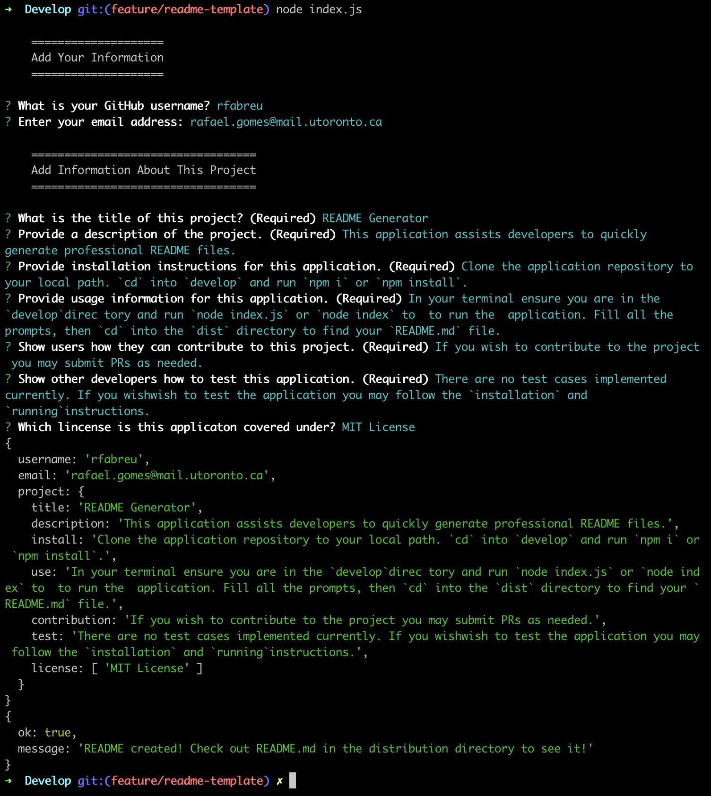

# README Generator

## Description
This application assists developers to quickly generate professional README files.  
As an example this `README` was created using this application.
## Table of Contents
- [Description](#description)
- [Installation](#installation)
- [Usage](#usage)
- [License](#license)
- [Contributing](#contributing)
- [Tests](#tests)
- [Questions](#questions)
## Installation
Clone the application repository to your local path. `cd` into `develop` and run `npm i` or `npm install`.
## Usage
In your terminal ensure you are in the `develop` directory and run `node index.js` or `node index` to to run the application. Fill all the prompts, then `cd` into the `dist` directory to find your `README.md` file.
   
### Application Run Process:

### Demo Video
Watch a demo of the application running: [App Demo](https://drive.google.com/file/d/1p-_po8fnrgY4lg3X1aOg0Pd4jjgSN-Yc/view)

 

## License
Licensed under the MIT license.
## Contributing
If you wish to contribute to the project you may submit PRs as needed.
## Tests
There are no test cases implemented currently. If you wish to test the application you may follow the `installation` and `running` instructions.
## Questions
GitHub: [github.com/rfabreu](https://github.com/rfabreu)
 
Comments, suggestions, questions? Contact me at: [rafael.gomes@mail.utoronto.ca](mailto:rafael.gomes@mail.utoronto.ca)